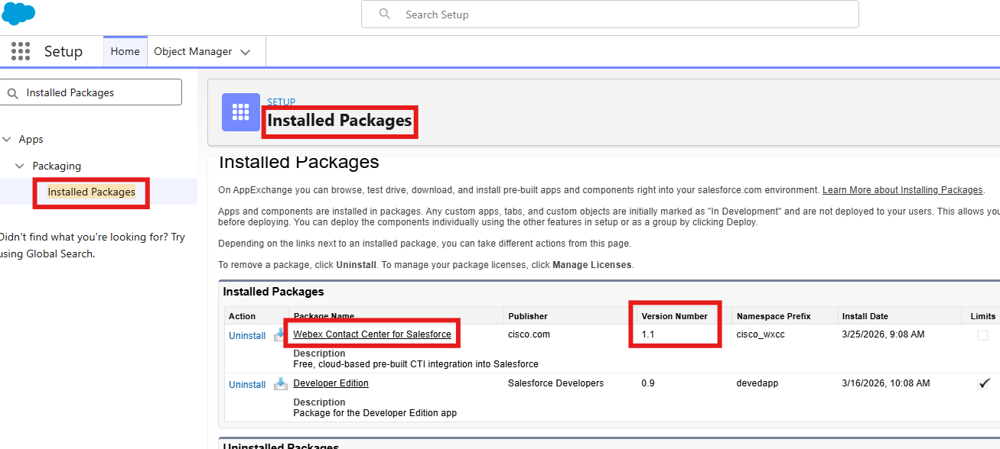

# Introduction 

!!! info "Task Objectives"
	- This page has the salesforce versions and external guides.
	- How to differentiate between the versions 
	
## Resource links

### 1. Salesforce - Version 1-Legacy  

| <!-- -->                  | <!-- -->         |
| ------------------------- | ---------------- |
| `Integration Guide`             | <a href="https://www.salesforce.com/products/free-trial/developer](https://help.webex.com/en-us/article/nhxw7kfb/Integrate-Webex-Contact-Center-with-Salesforce-(Version-1%E2%80%94Legacy)" target="_blank">https://www.salesforce.com/products/free-trial/developer](https://help.webex.com/en-us/article/nhxw7kfb/Integrate-Webex-Contact-Center-with-Salesforce-(Version-1%E2%80%94Legacy)/</a> |
| `Latest Updates`   | <a href="https://help.webex.com/en-us/article/nhxw7kfb/Integrate-Webex-Contact-Center-with-Salesforce-(Version-1%E2%80%94Legacy)#concept-template_ac93b49e-a5eb-4942-a734-26c8da471aae" target="_blank">https://help.webex.com/en-us/article/nhxw7kfb/Integrate-Webex-Contact-Center-with-Salesforce-(Version-1%E2%80%94Legacy)#concept-template_ac93b49e-a5eb-4942-a734-26c8da471aae/</a> |

### 2. Salesforce - Version 2-New

| <!-- -->                  | <!-- -->         |
| ------------------------- | ---------------- |
| `Integration Guide`             | <a href="https://help.webex.com/en-us/article/dyidod/Integrate-Webex-Contact-Center-with-Salesforce-(Version-2-New)" target="_blank">https://help.webex.com/en-us/article/dyidod/Integrate-Webex-Contact-Center-with-Salesforce-(Version-2-New)/</a> |
| `Access Guide`   | <a href="https://help.webex.com/en-us/article/n08vfjcb/Access-and-use-Webex-Contact-Center-within-Salesforce-(Version-2-New)" target="_blank">https://help.webex.com/en-us/article/n08vfjcb/Access-and-use-Webex-Contact-Center-within-Salesforce-(Version-2-New)/</a> |
| `Latest Updates`   | <a href="https://help.webex.com/en-us/article/dyidod/Integrate-Webex-Contact-Center-with-Salesforce-(Version-2-New)#concept_d3z_st5_hgc" target="_blank">https://help.webex.com/en-us/article/dyidod/Integrate-Webex-Contact-Center-with-Salesforce-(Version-2-New)#concept_d3z_st5_hgc/</a> |

### 3. Differentiate between versions 

| <!-- -->                  | <!-- -->         |
| ------------------------- | ---------------- |
| `Guide`             | <a href="https://techzone.cisco.com/t5/Contact-Center-3rd-Party/Playbook-CRM-Connector-Version-Matrix-Install-Store-Link/ta-p/16910365" target="_blank">https://techzone.cisco.com/t5/Contact-Center-3rd-Party/Playbook-CRM-Connector-Version-Matrix-Install-Store-Link/ta-p/16910365/</a> |

### 4. Installated Package Verification

- In Salesforce, navigate to **'Setup'** by clicking the gear icon in the top-right corner and selecting **'Setup'**.

{ width="350" }

- In the Salesforce portal, navigate to **Apps > Packagin > Installed Packahges** (or type _Installed Packages_ in the search bar above the left-hand menu).

{ width="600" }

