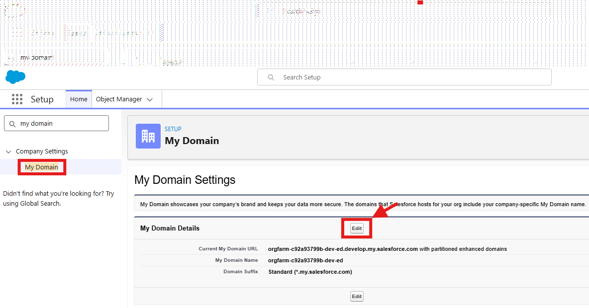
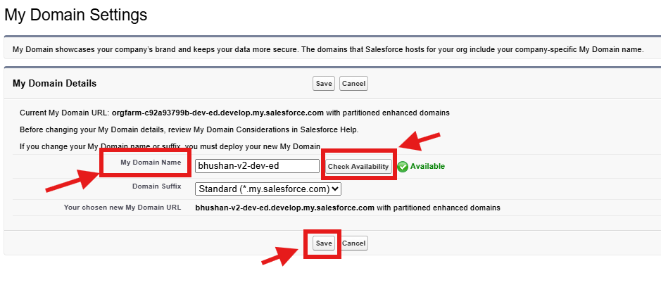

# Integrate Webex Contact Center with Salesforce Using the Legacy CRM Connector

	
Please use the following credentials to complete the tasks:

| <!-- -->                  | <!-- -->         |
| ------------------------- | ---------------- |
| `Control Hub`             | <a href="https://admin.webex.com" target="_blank">https://admin.webex.com</a> |
| `Salesforce`   | <a href="https://login.salesforce.com" target="_blank">https://login.salesforce.com/</a> |
| `Salesforce Developer Edition`   | Sign up link: <a href="https://www.salesforce.com/products/free-trial/developer" target="_blank">https://www.salesforce.com/products/free-trial/developer/</a> |

!!! info "Task Objectives"
	- Define and configure the Call Center in Salesforce and add users.
	- Create a softphone layout and set screen pop preferences.
	- Add the Webex Contact Center softphone to the Salesforce Sales app.
	- Test the Webex Contact Center softphone integration in Salesforce.

## 1. **Create Salesforce Trial Account**
- Navigate to Salesforce Developer portal:  <a href="https://www.salesforce.com/products/free-trial/developer" target="_blank">https://www.salesforce.com/products/free-trial/developer/</a> and log in and create an account 

!!! note
	Trial account only expires if its not logged in alteast once in 45 days. 

## 2. **Configure Legacy Connector**

!!! warning "Attention"
	Please use the **Firefox** browser to access, configure, and test within the Salesforce portal.

- Please use the "integrate" section of the guide for step by step installation  <a href="https://help.webex.com/en-us/article/nhxw7kfb/Integrate-Webex-Contact-Center-with-Salesforce-(Version-1%E2%80%94Legacy)#Cisco_Task_in_List_GUI.dita_6e0e23f7-7df8-4a52-872a-af63dff16f5c" target="_blank">https://help.webex.com/en-us/article/nhxw7kfb/Integrate-Webex-Contact-Center-with-Salesforce-(Version-1%E2%80%94Legacy)#Cisco_Task_in_List_GUI.dita_6e0e23f7-7df8-4a52-872a-af63dff16f5c/</a>

- Congratulations! You have complete the task.

## 3. Optional **Update the Salesforce Domain**

To update the domain (to something that you can remember or differentiate) you can follow the below steps 

- In Salesforce, navigate to **'Setup'** by clicking the gear icon in the top-right corner and selecting **'Setup'**.

{ width="350" }

- Navigate to **'Compnay Settings > My Domain'** (or type _My Domain_ in the search bar above the left-hand menu) anbd hit **Edit**

{ width="500" }

- Enter the **My Domain Name**, select** Check Availability** and **Save**

{ width="500" }

- Deploy the domain (this steps will take up to 15 mins minutes to complete but you receive an email once complete

